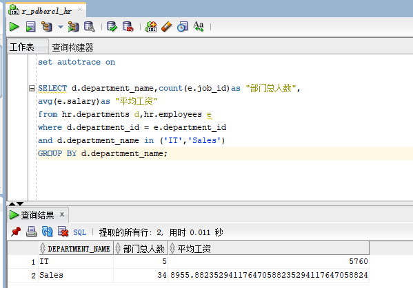
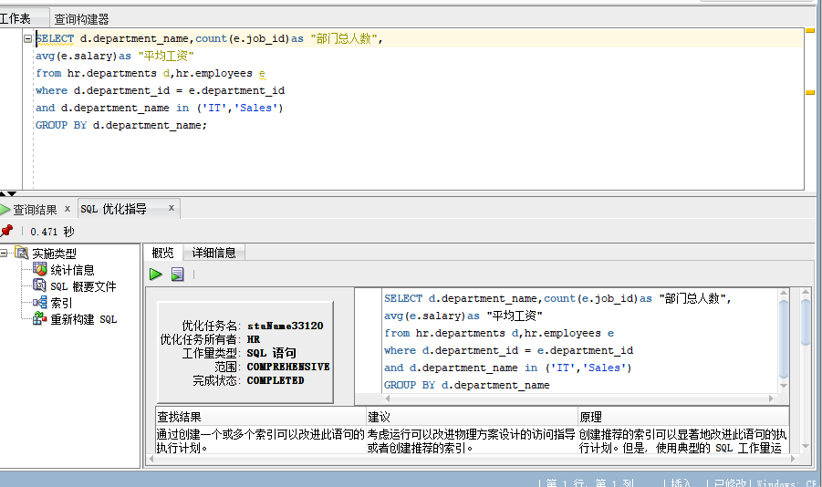
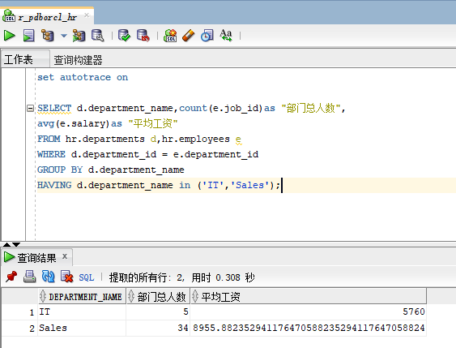
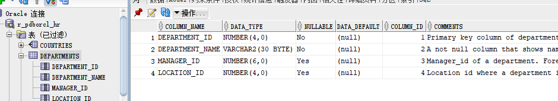
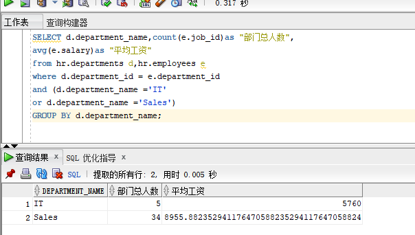

# 实验1：SQL语句的执行计划分析与优化指导

## 实验目的:
分析SQL执行计划，执行SQL语句的优化指导。理解分析SQL语句的执行计划的重要作用。

## 实验内容:
<ul>
    <li>对Oracle12c中的HR人力资源管理系统中的表进行查询与分析。</li>
    <li>首先运行和分析教材中的样例：本训练任务目的是查询两个部门('IT'和'Sales')的部门总人数和平均工资，以下两个查询的结果是一样的。但效率不相同</li>
    <li>设计自己的查询语句，并作相应的分析，查询语句不能太简单。</li>
</ul>

## 查询1(截图):
   
其优化建议截图:
  
根据其优化指导中的详细信息可分析得:Cost=5，Rows=20，Predicate Information中有一次全表搜索filter和一次索引搜索access
 
## 查询2(截图)
  
根据其优化指导中的详细信息可分析得:Cost=7，Rows=106，Predicate Information中有俩次全表搜索filter和一次索引搜索access
 
 
## 比较两个查询代码:
总的来看，还是查询1更优，因为除了“consistent gets=10”比查询2的“consistent gets=9”差1外，其他参数都优于查询2.此外，查询1是先过虑后汇总（where子句）。参与汇总与计算的数据量少。而查询2是先汇总后过滤（having子句），参与汇总与计算的数据量更多。

 # 当我们根据优化指导，在department表上创建俩个DEPARTMENT_NAME和DEPARTMENT_ID索引字段后建立索引后:
索引截图:
  
当我们再次运行，可以在详细信息中看到:
------------------------------------------------------------------------------------------
| Id  | Operation  | Name  | Rows  | Bytes | Cost (%CPU)| Time     |
------------------------------------------------------------------------------------------
| 0 | SELECT STATEMENT     |        |     2 |    46 |     2   (0)| 00:00:01 |  
| 1 | SORT GROUP BY NOSORT |        |     2 |    46 |     2   (0)| 00:00:01 |  
| 2 | NESTED LOOPS         |        |    19 |   437 |     2   (0)| 00:00:01 |  
| 3 | NESTED LOOPS         |        |    20 |   437 |     2   (0)| 00:00:01 |  
| 4 | INLIST ITERATOR      |        |       |       |            |          |  
|*5 | INDEX RANGE SCAN     | INDEX1 |     2 |    32 |     1   (0)| 00:00:01 |  
|*6 | INDEX RANGE SCAN     | IDX$$_04440001 |    10 |  |     0   (0)| 00:00:01 |  
| 7 | TABLE ACCESS BY INDEX ROWID| EMPLOYEES      |    10 |    70 |     1   (0)| 00:00:01 |  
------------------------------------------------------------------------------------------

 
Query Block Name / Object Alias (identified by operation id):
-------------------------------------------------------------
 
   1 - SEL$1
   5 - SEL$1 / D@SEL$1
   6 - SEL$1 / E@SEL$1
   7 - SEL$1 / E@SEL$1
 
Predicate Information (identified by operation id):
---------------------------------------------------
 
   5 - access("D"."DEPARTMENT_NAME"='IT' OR "D"."DEPARTMENT_NAME"='Sales')
   6 - access("D"."DEPARTMENT_ID"="E"."DEPARTMENT_ID")
 
明显看到查询DEPARTMENT_NAME的速度加快了，Predicate Information中已没有全表搜索filter，只有索引搜索access。

# 自编码(截图):
  
我自己编写的代码是在查询代码1的基础上进行改变变的，就是把代码
<table border='1'><th>...and d.department_name in('IT','Sales') 变成 
 ...and (d.department_name='IT' or d.department_name='Sales')</th></table>
 两者相似，其优化方式相同，增加索引即可加快搜索速度，提高代码的优良性。