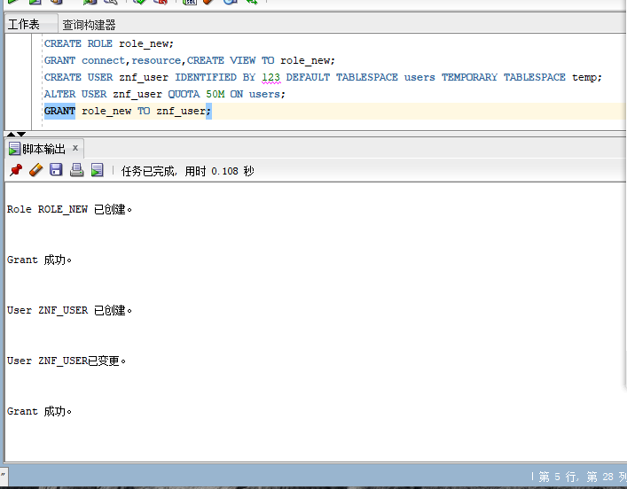
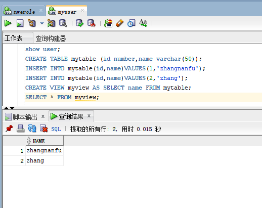
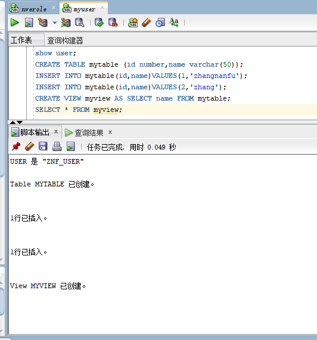
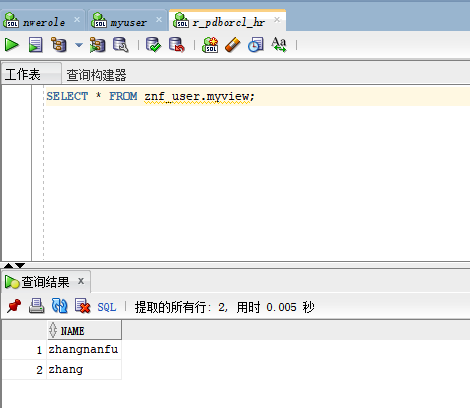

# 实验2：用户及权限管理

## 实验目的:
掌握用户管理、角色管理、权根维护与分配的能力，掌握用户之间共享对象的操作技能。

## 实验内容:
Oracle有一个开发者角色resource，可以创建表、过程、触发器等对象，但是不能创建视图。本训练要求：
<ul>
    <li>在pdborcl插接式数据中创建一个新的本地角色con_res_view，该角色包含connect和resource角色，同时也包含CREATE VIEW权限，这样任何拥有con_res_view的用户就同时拥有这三种权限。</li>
    <li>创建角色之后，再创建用户new_user，给用户分配表空间，设置限额为50M，授予con_res_view角色。</li>
    <li>最后测试：用新用户new_user连接数据库、创建表，插入数据，创建视图，查询表和视图的数据。</li>
</ul>

## 实验登录用到的参数  
Oracle地址：202.115.82.8 用户名：system,hr,znf_user， 密码123， 数据库名称：pdborcl，端口号：1521

## 首先以system登录到pdborcl，创建角色role_new和自己的用户名znf_user，并授权和分配空间：(截图)
   

 
## 用自己创建的新用户znf_user连接到pdborcl，创建表mytable和视图myview，插入数据，最后将myview的SELECT对象权限授予hr用户：(截图)
  
  

## 用户hr连接到pdborcl，查询new_user授予它的视图myview:(截图)
  

# 测试同学用户之间的表的共享，只读共享和读写共享都测试：
<table border='1'><th> 以znf_uer用户连接数据库，并将自己的表mytable的select权限授予同学账户he GRANT SELECT ON myview TO he;只读 
GRANT SELECT，UPDATE ON myview TO he;读写共享 
 然后同学账户he连接数据库查询语句和修改语句进行验证</th></table>

# 数据库和表空间占用分析:
当全班同学的实验都做完之后，数据库pdborcl中包含了每个同学的角色和用户。 所有同学的用户都使用表空间users存储表的数据。 表空间中存储了很多相同名称的表mytable和视图myview，但分别属性于不同的用户，不会引起混淆。 随着用户往表中插入数据，表空间的磁盘使用量会增加。  
