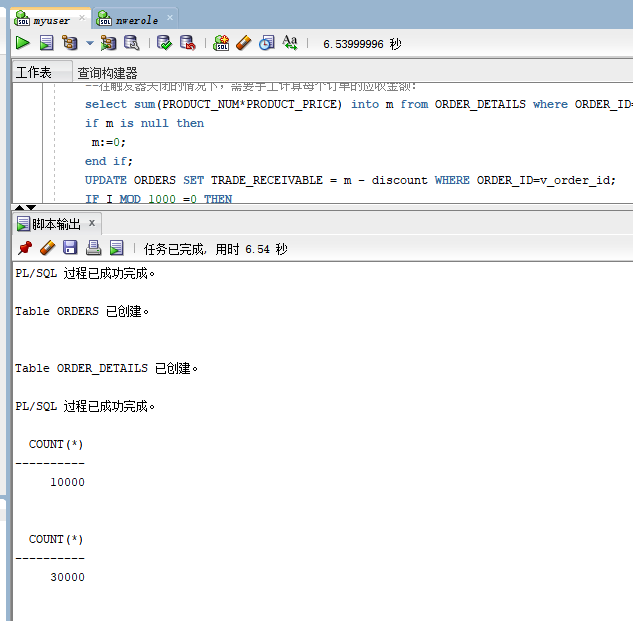
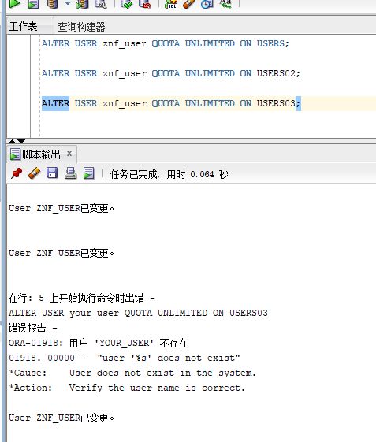
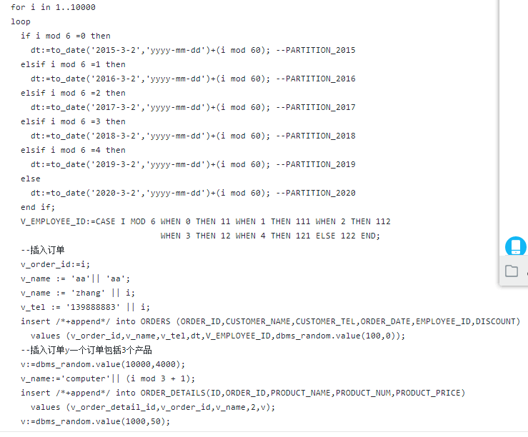
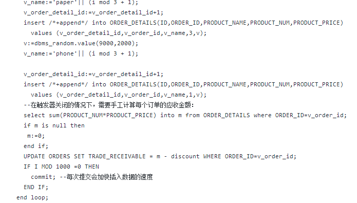
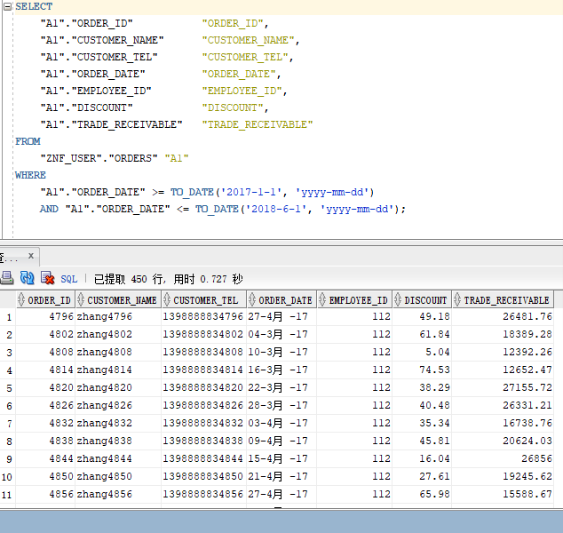
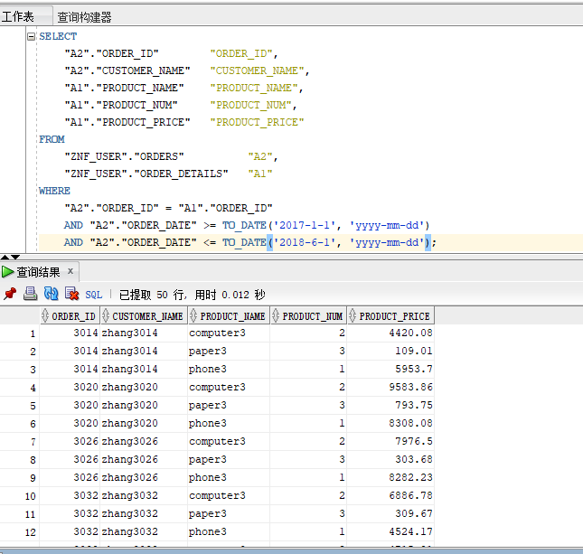

# 实验3：创建分区表

## 实验目的:
掌握分区表的创建方法，掌握各种分区方式的使用场景。

## 实验内容:
<ul>
    <li>本实验使用3个表空间：USERS,USERS02,USERS03。在表空间中创建两张表：订单表(orders)与订单详表(order_details)。</li>
    <li>使用你自己的账号创建本实验的表，表创建在上述3个分区，自定义分区策略。</li>
    <li>你需要使用system用户给你自己的账号分配上述分区的使用权限。你需要使用system用户给你的用户分配可以查询执行计划的权限。</li>
    <li>表创建成功后，插入数据，数据能并平均分布到各个分区。每个表的数据都应该大于1万行，对表进行联合查询。</li>
    <li>写出插入数据的语句和查询数据的语句，并分析语句的执行计划。</li>
    <li>进行分区与不分区的对比实验。</li>
</ul>

## 实验登录用到的参数  
Oracle地址：202.115.82.8 用户名：system,hr,znf_user， 密码123， 数据库名称：pdborcl，端口号：1521

## 在主表orders和从表order_details之间建立引用分区 在study用户中创建两个表：orders（订单表）和order_details（订单详表），两个表通过列order_id建立主外键关联。orders表按范围分区进行存储，order_details使用引用分区进行存储：(截图)
   

 
## 使用system用户给你自己的账号分配上述分区的使用权限：(截图)
  

# 写出插入数据的语句和查询数据的语句，并分析语句的执行计划：
## 插入数据的语句:(截图)
  
  

## 查询数据的语句:
<table border='1'><tb>select * from your_user.orders where order_date 
between to_date('2017-1-1','yyyy-mm-dd') and to_date('2018-6-1','yyyy-mm-dd'); 
 
</tb><tb>&nbsp;</tb><tb>select a.ORDER_ID,a.CUSTOMER_NAME,
b.product_name,b.product_num,b.product_price 
from your_user.orders a,your_user.order_details b where
a.ORDER_ID=b.order_id and
a.order_date between to_date('2017-1-1','yyyy-mm-dd') and to_date('2018-6-1','yyyy-mm-dd');</tb></table>

# 第一个查询语句:（截图）
  

# 第二个查询语句:（截图）
  

# 分析语句的执行计划:
插入语句是用for循环从1至10000，循环插入数据至表中
第一个查询语句是从我创建的订单表中查询在2017年一月一日和2018年六月一日之间所有订单的信息，第二个查询语句是从我创建的订单表和订单详情中查询在2017年一月一日和2018年六月一日之间所有订单的ID，客户名，产品名，产品数以及产品价格。