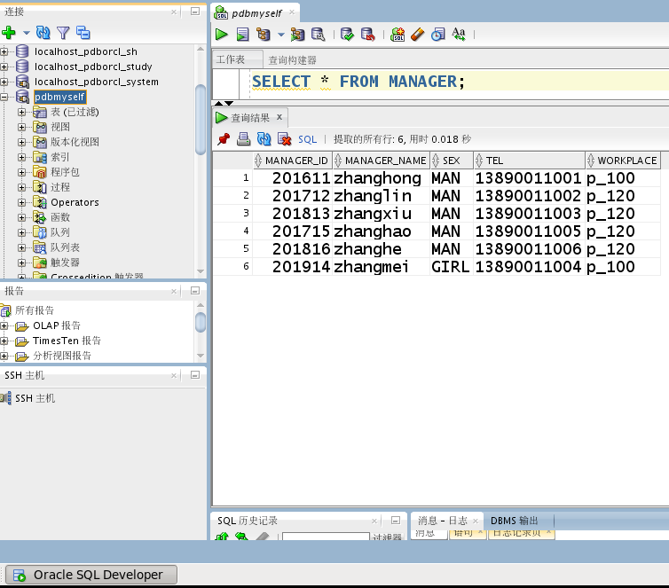
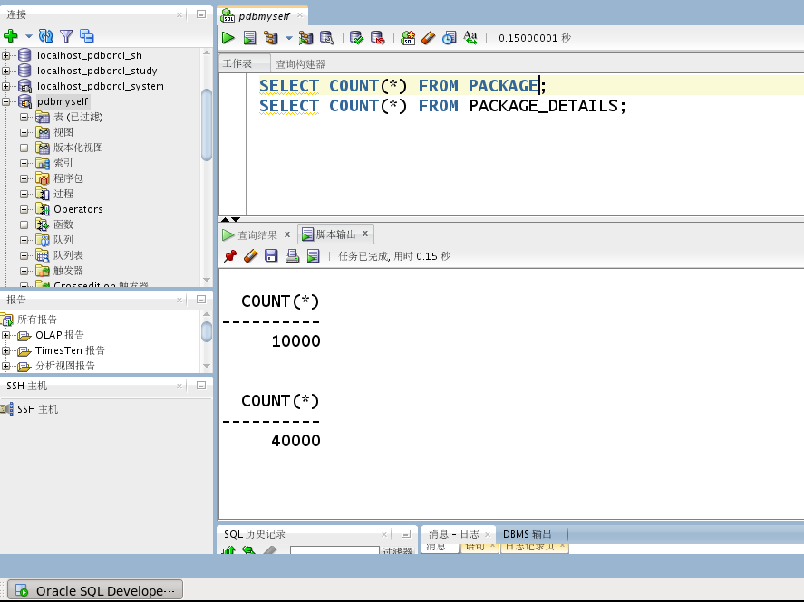
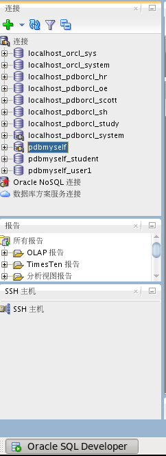
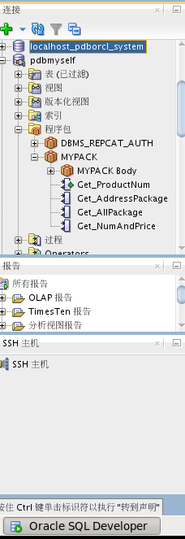
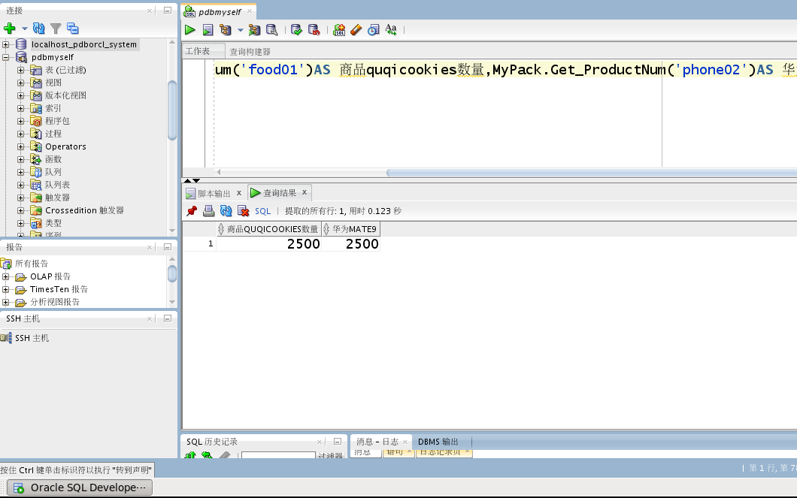
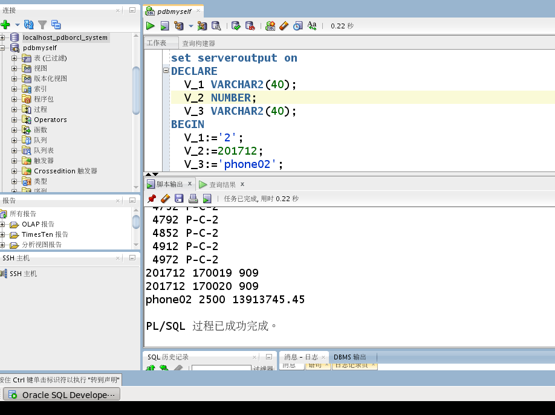

# 实验6（期末考核）：基于Oracle的快递管理的数据库设计

## 期末考核要求：
    1.自行设计一个信息系统的数据库项目，自拟某项目名称。
    2.设计项目涉及的表及表空间使用方案。至少5张表和5万条数据，两个表空间。
    3.设计权限及用户分配方案。至少两类角色，两个用户。
    4.在数据库中建立一个程序包，在包中用PL/SQL语言设计一些存储过程和函数，实现比较复杂的业务逻辑，用模拟数据进行执行计划分析。
    5.设计自动备份方案或则手工备份方案。
    6.设计容灾方案。使用两台主机，通过DataGuard实现数据库整体的异地备份。
##  场景分析：
  本系统是模拟某快递公司对商品快递的管理过程。管理模式为：某收件人通过商家网站，或联系商家等方式，购买了商家里的某商品，告知商家个人信息。而商家则把商品交给快递公司，由快递公司的管理员发给商家一个有相关信息的单子，让商家填写相关信息，确认后返回给管理员，管理员再生成快递单，交由管理的快递员，即让快递员领取快递，并进行派送至目的地，等待客户收货。

## 考核内容：
### 内容2：
  user01（分配一个数据文件：pdbmyself_user01.dbf，大小为100M）和user02（分配两个数据文件：pdbmyself_user02_1.dbf和pdbmyself_user02_2.dbf，大小各自为100M，共计200M）。 
    Create  tablespace  user01  datafile 
        ‘/home/oracle/app/oracle/oradata/orcl/pdbmyself/pdbmyself_user01.dbf’
        size 100M autoextend on next 50M maxsize unlimited extent management 
        local segment  space management auto;

    Create  tablespace  user02  datafile 
        ‘/home/oracle/app/oracle/oradata/orcl/pdbmyself/pdbmyself_user02_1.dbf’
        size 100M autoextend on next 50M maxsize unlimited extent management 
        local segment  space management auto;
        
    Create  tablespace  user02  datafile
        ‘/home/oracle/app/oracle/oradata/orcl/pdbmyself/pdbmyself_user02_2.dbf’
        size 100M autoextend on next 50M maxsize unlimited extent management 
        local segment  space management auto;
 
  管理员表(MANAGER)截图: 
  
  插入快递单以及快递详单的数据的脚本内容太多，详情参见文档。其设计过程是参照实验test3.sql，以下截图是查询数据总条数： 
  

###  内容3：
  创建一个用户“student”，为此用户分配表空间的使用配额，分配角色CONNECT和RESOURCE，以便用户可以连接数据库，可以创建资源（表，过程，序列等资源对象），还可以为其分配一个系统权限：创建视图（create view）。 
    create user student identified by 123
      default tablespace “users01”
      temporary tablespace “temp”;

    --quotas
    alter user student quota unlimited on users01;
    alter user student quota unlimited on users02;

    --roles
    create role con_res_view;
    grant connect，resource，create view to con_res_view;
    grant con_res_view to student;
  而用户user1则只分配权限“select on view_package_details”,即后续会创建的快递详单视图，此用户只会查询此详单视图的信息，无法修改，增添或者删除，具体的分配权限操作会在后面进行。三个用户截图: 
  

###  内容4：
  创建一个程序包，包名为MyPack，此程序包中有一个函数和三个过程，分别为：
    函数一，查询某产品的快递单总数:Get_ProductNum(V_PRODUCTS_ID VARCHAR2(40)),
    过程一，查询某个区的所有快递单的信息:Get_AddressPackage(V_KEY_ADDRESS VARCHAR2(40)),
    过程二，查询在某个管理员下的快递员派送的总单子数:Get_AllPackage(V_MANAGER_ID NUMBER),
    过程三，查询某个商品的快递总数量和总金额:Get_NumAndPrice(V_PRODUCTS_ID VARCHAR2(40)).
  在用户system下创建，再分别用模拟数据，调用函数和过程测试是否成功创建：
    create or replace PACKAGE MyPack IS
      FUNCTION Get_ProductNum(V_PRODUCTS_ID VARCHAR2) RETURN NUMBER;
      PROCEDURE Get_AddressPackage(V_KEY_ADDRESS VARCHAR2);
      PROCEDURE Get_AllPackage(V_MANAGER_ID NUMBER);
      PROCEDURE Get_NumAndPrice(V_PRODUCTS_ID VARCHAR2);
    END MyPack;

    create or replace PACKAGE BODY MyPack IS
      FUNCTION Get_ProductNum(V_PRODUCTS_ID VARCHAR2) RETURN NUMBER
      AS
        N NUMBER(20,2);
        BEGIN
          SELECT COUNT(*) into N  FROM PACKAGE_DETAILS O
          WHERE O.PRODUCTS_ID=V_PRODUCTS_ID;
          RETURN N;
        END;
    PROCEDURE Get_AddressPackage(V_KEY_ADDRESS VARCHAR2)
      AS
        begin
          for v in
          (SELECT  package_id,receiver_address FROM package
            WHERE receiver_address like '%'||V_KEY_ADDRESS)
          LOOP
            DBMS_OUTPUT.PUT_LINE(' '||V.PACKAGE_ID||' '||v. receiver_address);
          END LOOP;
      END;

    PROCEDURE Get_AllPackage(V_MANAGER_ID NUMBER)
      AS
        begin 
          --使用游标
          for v in
          (SELECT COURIER_ID,COUNT(COURIER_ID)AS Total FROM PACKAGE WHERE COURIER_ID IN(SELECT COURIER_ID FROM COURIER WHERE MANAGER_ID=V_MANAGER_ID))
          LOOP
            DBMS_OUTPUT.PUT_LINE(V_MANAGER_ID||‘ ‘||V.COURIER_ID||' '||v.Total);
          END LOOP;
      END;

    PROCEDURE Get_NumAndPrice(V_PRODUCTS_ID VARCHAR2)
    AS
      Begin
      For v in
      (SELECT COUNT(PRODUCTS_ID)AS Num,SUM(PRODUCTS_PRICES)AS AllPrices FROM 
    PACKAGE_DETAILS WHERE PRODUCTS_ID=V_PRODUCTS_ID)
      LOOP
            DBMS_OUTPUT.PUT_LINE(V_PRODUCTS_ID||’ ’||v.Num||’ ‘||v.AllPrices);
      END LOOP;
    END;
    END MyPack;
    /
  
  拟定测试调用函数的输入参数V_PRODUCTS_ID为‘food01’和’phone02’，即查询商品id为‘food01’，‘phone02’的商品的快递详单总数目：截图如下 
  
  拟定测试调用过程的输入参数V_KEY_ADDRESS，V_MANAGER_ID，V_PRODUCTS_ID分别为：
  ‘2’，201712，‘phone02’，V_1=’2’ 即是在区域P-C-2的快递单有哪些，请列出来，V_2:=201712 ，在管理员id为201712下的快递员派出的总件数是多少，V_3:=’phone02’ ，派出的快递中，商品id为‘phone02’的总价值为多少，即把快递详单中商品id为此值的总价加起来：截图如下 
  

### 内容5：
  此方案是按照书P347上的13.4.6 实用案例：完全恢复一个PDB，根据此例子写出方案。方案的备份策略采用完整的压缩备份集方式备份，并且备份完成之后，删除过期的备份文件和归档日志文件，这个样做可以节约出db_recovery_file_dest_size允许的空间，数据库运行期间就不会产生归档日志满的错误。
  恢复是恢复一个PDB数据库，即是创建的数据库pdbmysef。这样做的好处是在恢复时只需要使损坏的PDB停机，而不会将整个数据库停机，保证其他数据库正常使用。具体操作如下：
  首先，在数据库pdbmysef正常工作，即数据还没有遭到破坏时，手动备份整个数据库。操作为：RMAN连接数据库，然后完整压缩备份整个数据库，删除过期的备份和归档日志，查看备份结果，主要看新创建的PDB数据库pdbmysef的备份集：
    $ rman target /
    RMAN> SHOW ALL;
    ...
    RMAN> BACKUP AS COMPRESSED BACKUPSET DATABASE;
    RMAN> LIST BACKUP;
    RMAN> REPORT OBSOLETE;
    RMAN> DELETE OBSOLETE;
  如果在平时的操作过程中造成pdbmysef出故障，不能正常工作时需要对pdbmysef进行完全恢复，但在恢复之前需要先删除出故障的pdbmysef的所有文件，然后再关闭pdbmysef，在sqlplus中完成，重新打开一个系统命令窗口，运行sqlplus：
    $ rman target /
    RMAN> host “rm /home/oracle/app/oracle/oradata/orcl/pdbmysef/*.dbf”;
  
    $ sqlplus / as sysdba
    SQL> SHOW PDBS;
    ...
    SQL> ALTER SESSION SET CONTAINER =pdbmysef;
    ...
    SQL> SHUTDOWN IMMEDIATE;
    ...
    SQL> EXIT
  上述操作中，show pdbs后虽然数据库文件全被删除了，但还是可以看到pdbmysef的状态任为正常的读写状态（READ_WRITE），但是当session切换到pdbmysef里，执行各SQL语句时会发现“无法打开文件”的错误。最后之执行“showdown immediate;”看到“Pluggable Database closed”的时候，就表示pdbmysef被关闭了。此时就可以回到RMAN中单独恢复pdbmysef：
    RMAN> RESTORE PLUGGABLE DATABASE pdbmysef；
    RMAN> RECOVER PLUGGABLE DATABASE pdbmysef；
    ...
    RMAN> ALTER PLUGGABLE DATABSE pdbmysef open;
  最后的“ALTER PLUGGABLE DATABSE pdbmysef open;”命令打开pdbmysef没有报错，也没有加
  Resetlogs选项，这就说明pdbmysef完全恢复成功，没有损失数据。

